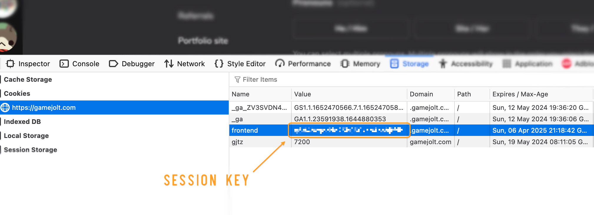

# GameJolt API Toolkit
Purely for educational purposes, this toolkit is a collection of scripts that interact with the GameJolt API. The toolkit is written in Python and uses the requests library to make HTTP requests to the GameJolt fronted API.

I will update scripts form time to time, add more that are useful. Please note that some scripts might be outdated and not work properly because this is not a supported project by GameJolt.

## Scripts
The scripts contained in this toolkit. They all have a link to a Jupyter Notebook, a last update date (which is the last time I checked if the script works), and a description of what the script does. I also state what the scripts will output.

All outputs are put in `data/` directory, which is created if it doesn't exist. The outputs are in CSV format. Some scripts may create additional files, like temporary JSON files.

> [!IMPORTANT] These scripts are scrapers, they not only take a while to run (speculatively) but you may also be termporarily rate limited/blocked by the GameJolt servers.

### 1. Fetch all user charges **[Creator Only]**
- [`fetch_user_charges.ipynb`](fetch_user_charges.ipynb)
- **Last worked:** 12th of May 2024 

Fetches all the charges made by users on your posts (and legacy Fireside feature). It allows you to specify a date range (**from** and **to**), script will try its best to fetch all charges within that range, or you can also leave it full range.

If you specify an existing log file (.csv), the script will append the new charges (changes) and also overwrite the input **from** date range.

#### Outputs
`USERNAME-supports.csv` for logging charges with the following columns:
| Column | Description |
| --- | --- |
| `id` | The unique ID of the charged sticker action (support action). |
| `user_name` | The username of the supporter. |
| `user_id` | The ID of the supporter user. |
| `user_avatar` | The URL of the avatar of the supporter. |
| `follower_count` | The number of followers the supporter has on Gamejolt. |
| `timestamp` | The timestamp of when the user supported. |
| `post_id` | The ID of the post the supporter supported (can be null if not a post). |

`USERNAME-supports-posts.json` for logging post data with the following columns:
| Column | Description |
| --- | --- |
| `slug` | The slug of the post. |
| `like_count` | The number of likes the post has. |
| `comment_count` | The number of comments the post has. |
| `view_count` | The number of views the post has. |
| `published_on` | The timestamp of when the post was published. |
| `lead_str` | The lead string of the post (title). |


## Authentication with GameJolt
To fetch the data, you need to use your **session cookie.** 

You can get this cookie by first logging in to the website and then copying the cookie from the browser (Inspect element > Storage > Cookies > `https://gamejolt.com`), called `frontend`. We can then use this cookie to scrape the data from the API. 



Then, create a `config.py` file in this directory and add the following lines:

```python
# config.py
GJ_COOKIE = 'your_session_cookie'
```

**Don't share this session cookie to others, it can be used to hijack your account.**

> [!NOTE] This is essential for the scripts because it is used to authenticate the user (you) and make requests to the GameJolt API.

## Contributions
You are very much free to contribute to this project with your own ideas and scripts. Create a pull request and I will review it. If you have any questions, feel free to open an issue. Keep the overall structure of the repository and scripts and keep it clean, update documentation(s) if you add a new script.

## Ethics & GameJolt TOS
This toolkit is used to enhance user experience and you should not use it for malicious purposes. Its aim is to help creators get valuable insights on the platform, which unforunately is not provided by GameJolt (yet).

You will be using this tooklit at your own risk. Scraping data from GameJolt is [against their TOS](https://gamejolt.com/terms) _(Art 5: Acceptable Use Policy)_, and you should get proper clearance from the GameJolt team before using this toolkit.